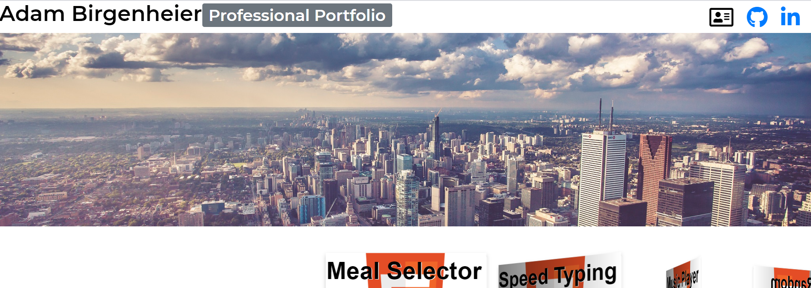
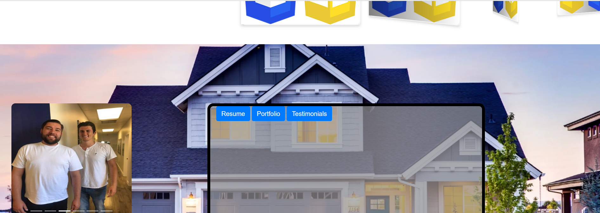

# Professional Portfolio
> A simple, single-page website that has all social media, contact information, and professional accomplishes stashed for future reference.

 > A professional portfolio that uses parallax, boot strap, materialize, swiperJS, jquery, fontawsome, google fonts, and pagination for full UE. Four fundamental sections which include: (1) Navbar -- contact information, along with links to github and linkedin. (2) Project slider -- all projects for all coding languages todate; HTML, CSS, JS, Node.js, Python, Excel/VBA. (3) Personal Pictures/References -- dual slider that contains both professional and personal pictures, paired with a miniture jumbotron that allows the user to view resume, professional real estate investment portfolio, and testimonials. (4) Footer -- contains all links to personal social media.

## Usage example

 > Can be used by past, present, and future students, peers, and coworkers alike to see the dynamism in projects created, both practical through real estate investment means, as well as through simply full-stack development applications.

_For more examples and usage, please refer to the [Wiki][wiki]._

## Link

https://adambear1.github.io/Professional-Portfolio.io/

